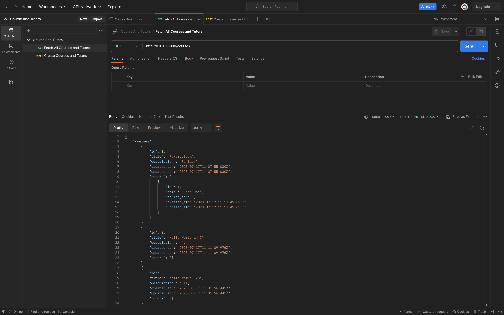
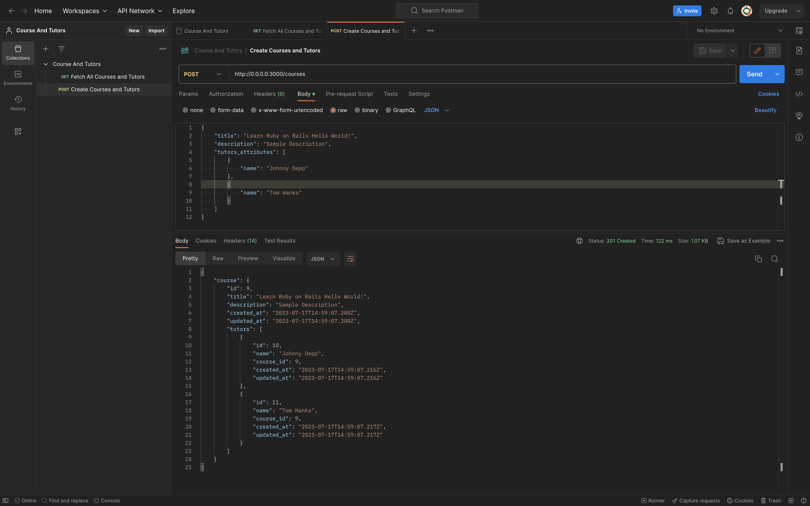

# Course And Tutors

### Requirements
- Ruby 3.1.2
- Rails 7.0.6
- SQLite3 (Default minimal database provided by rails)

### Steps to setup

Steps to setup the project on local  
1. Clone the project to your local machine
2. Go to root of the project folder
3. Run `bundle install`
4. Setup the database by running the below commands
   1. Run `rails db:create`
   2. Run `rails db:migrate`
5. Start the application by running `rails server`
6. Run `rspec` to run the specs 

### Fetch all Courses along with Tutors  
**METHOD:** GET   
**Endpoint:**  http://0.0.0.0:3000/courses  




### Create Course along with its Tutors  
**Method:** POST   
**Endpoint:** http://0.0.0.0:3000/courses   
**Payload**
```json
{
    "title": "Learn Ruby on Rails Hello World!",
    "description": "Sample Description",
    "tutors_attributes": [
        {
            "name": "Johnny Depp"
        },
        {
            "name": "Tom Hanks"
        }
    ]
}
```

  
